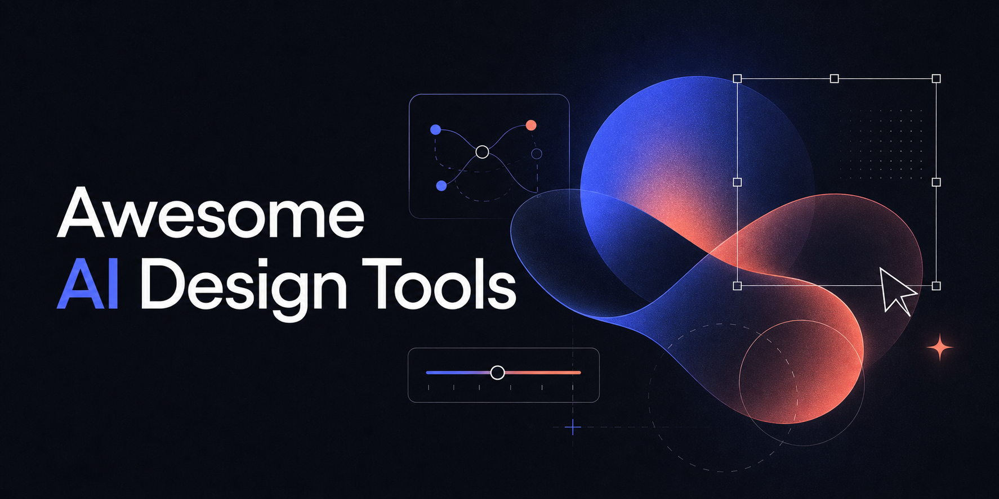

# Awesome AI Design Tools 

### A curated, opinionated map of tools at the seam of design and AI — for design technologists who ship.

Maintained by [Tek](https://www.timurtek.com). Curated for taste, not for SEO. If a tool is here, it earns its place.

---

> **Why this list exists.** Every "best AI design tools" roundup is an affiliate farm. This one isn't. I'm a design technologist working at the design × AI seam every day, and this is the map I actually use — organized by the *job* you're trying to do, with an honest one-line take on each tool. PRs welcome (see [Contributing](#contributing)).

## Contents

- [Text → UI (prompt in, design out)](#text--ui)
- [Design → Code (your design, shipped as code)](#design--code)
- [Prompt → App (prompt in, working app out)](#prompt--app)
- [Design Systems & Tokens](#design-systems--tokens)
- [AI in the IDE (the designer-developer bridge)](#ai-in-the-ide)
- [UX Research & Synthesis](#ux-research--synthesis)
- [How I'd choose](#how-id-choose)
- [Contributing](#contributing)

---

## Text → UI

Prompt in, high-fidelity design out. Best for getting from a blank canvas to a credible first draft.

- **[Claude Design](https://claude.com/product/design)** — Anthropic's beta. Describe a prototype, deck, or one-pager and Claude drafts it, then imports your real design system (from GitHub, design files, or your codebase) so output looks like your brand, not a template. Bridges to code via Claude Code (`/design-sync`); exports to PPTX/PDF/HTML. The standout for design-system-aware generation that hands off cleanly to dev.
- **[Figma Make](https://www.figma.com/ai/)** — AI generation living inside Figma, so your output stays editable in the tool you already use. The default choice if you live in Figma.
- **[Google Stitch](https://stitch.withgoogle.com/)** — Google's AI-native design canvas (this is what Galileo AI became after the acquisition). Relaunched in 2026 with an infinite canvas and context-aware design agents. Strong at "describe a fintech dashboard, get appropriate components." Free in beta.
- **[Uizard](https://uizard.io/)** — fast, approachable text/screenshot → editable mockups. Great for non-designers and early ideation.
- **[UX Pilot](https://uxpilot.ai/)** — wireframes and hi-fi screens that respect a fed-in design system. Good when brand consistency matters from the first draft.
- **[Banani](https://www.banani.co/)** — prompt-to-UI aimed at product designers; quick exploration of flows.

## Design → Code

You already have the design. These turn it into production-ish code. This is the category most relevant to your front-end + design-systems positioning.

- **[Builder.io Visual Copilot](https://www.builder.io/m/design-to-code)** — the most technically sophisticated of the bunch. Uses an AI model plus the open-source [Mitosis](https://github.com/BuilderIO/mitosis) compiler to turn flat Figma into real component hierarchies across frameworks. My pick when code quality matters.
- **[Anima](https://www.animaapp.com/)** — most consistent multi-framework output (React/HTML/CSS/Vue); clean enough to work with directly. Edges toward "product builder."
- **[Locofy](https://www.locofy.ai/)** — modular, reusable components with smart class naming and proper props. The closest Anima alternative; often more readable output.
- **[TeleportHQ](https://teleporthq.io/)** — visual builder with code export; handy for landing pages and lighter front-ends.
- **[Rocket (formerly DhiWise)](https://www.rocket.new/)** — DhiWise rebranded to Rocket; now a prompt-to-app builder with strong Figma-to-code accuracy. Sits between this category and prompt-to-app.

## Prompt → App

Prompt in, deployed app out. The line between "design tool" and "app builder" is dissolving here.

- **[v0](https://v0.app/)** — Vercel's prompt/reference → production React/Next.js, with instant deploy. The strongest end-to-end option if you're in the React/Next ecosystem (which, per your stack, you are).
- **[Bolt.new](https://bolt.new/)** — full-stack app generation in-browser with live preview.
- **[Lovable](https://lovable.dev/)** — prompt-to-app aimed at shipping real products fast.

## Design Systems & Tokens

The least crowded, most defensible corner — and the one closest to your edge.

- **[Tokens Studio](https://tokens.studio/)** — the serious design-tokens toolchain for Figma; pipelines tokens into code.
- **[Style Dictionary](https://styledictionary.com/)** — Amazon's build system for transforming design tokens across platforms. The backbone of most token pipelines.
- **[Specify](https://specifyapp.com/)** — design data platform for distributing tokens/assets from source of truth to code.
- **[Supernova](https://www.supernova.io/)** — design system management and documentation with code automation.

> _This is where a sharp open-source contribution from you could plant a flag — e.g. a tokens-to-[your-framework] CLI. Few credible people sit at tokens × AI._

## AI in the IDE

The designer-developer bridge — where handoff is quietly disappearing.

- **[Figma MCP server](https://developers.figma.com/docs/figma-mcp-server/)** — exposes Figma context to AI coding agents (Cursor, Claude, etc.). Pull design context into code; push rendered UI back to the Figma canvas as editable frames. The most important interop development for design technologists right now.
- **[Cursor](https://cursor.com/)** — the AI-native IDE where a lot of design-to-code work now happens; reads exported specs/tokens and implements them.
- **[Claude Code](https://www.claude.com/product/claude-code)** — terminal-based agentic coding; strong for turning design intent into working front-ends.

## UX Research & Synthesis

Demand for research is climbing; AI is eating the synthesis grunt-work.

- **[Maze](https://maze.co/)** — AI-assisted testing and research, with synthesis and reporting.
- **[Dovetail](https://dovetail.com/)** — research repository with AI tagging and insight surfacing.
- **[Notably](https://www.notably.ai/)** — AI-native research analysis and synthesis.

---

## How I'd choose

- **In Figma, want it to stay editable?** → Figma Make.
- **Care most about code quality out?** → Builder.io Visual Copilot or Anima.
- **Living in React/Next and want a deployed app?** → v0.
- **Brand/design-system consistency from draft one?** → UX Pilot.
- **Want generation that respects your design system and hands off to code?** → Claude Design.
- **Bridging design and a real codebase?** → Figma MCP + Cursor/Claude Code.

No single tool wins. The skill — and the reason a design technologist still matters — is knowing which job needs which tool, and stitching them.

## Contributing

PRs welcome, with a high bar. To add a tool:

1. It must do something genuinely useful at the design × AI seam — no "AI-washed" filler.
2. One honest sentence on what it's *for* and where it's strong. No marketing copy.
3. Put it in the right job-to-be-done section.
4. Link to the official site, not an affiliate URL.

Disagree with a take? Open an issue — arguments about taste are the point.

---

Curated by [**Tek**](https://www.timurtek.com) — design technologist at the seam of design and AI.

[Website](https://www.timurtek.com) · [GitHub](https://github.com/timurtek) · [LinkedIn](https://www.linkedin.com/in/timurtek/)

